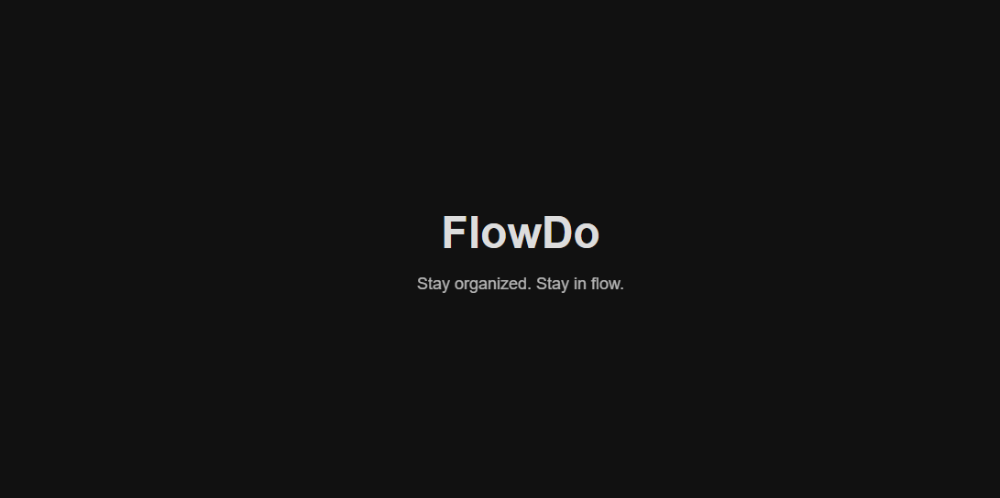
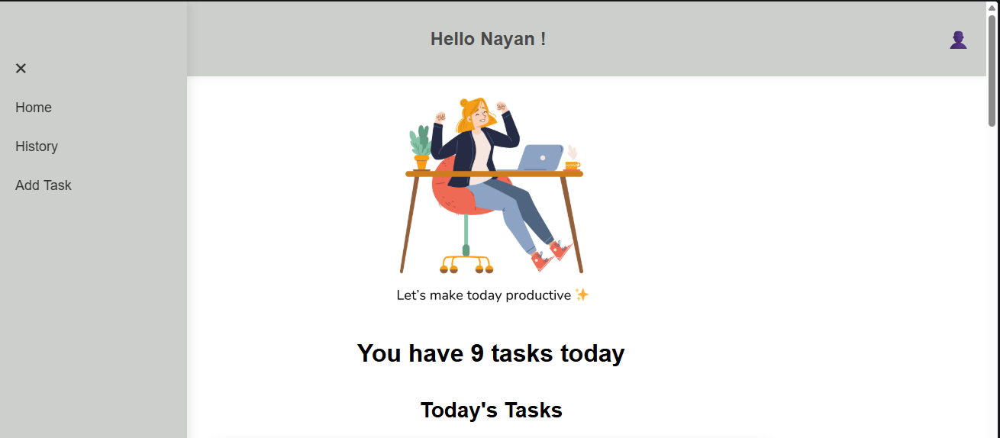
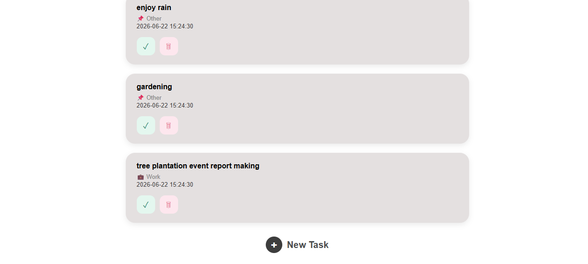
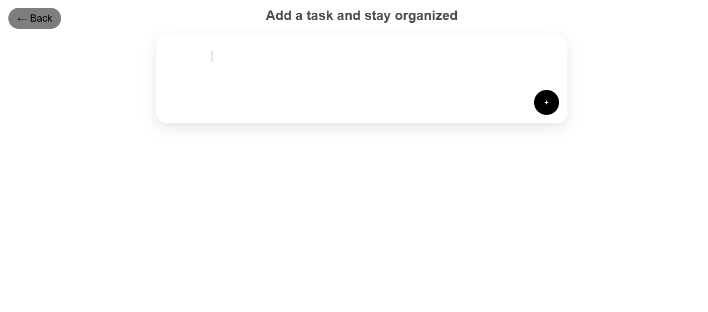
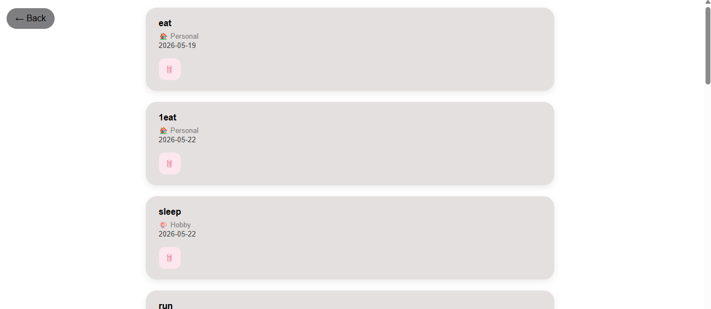
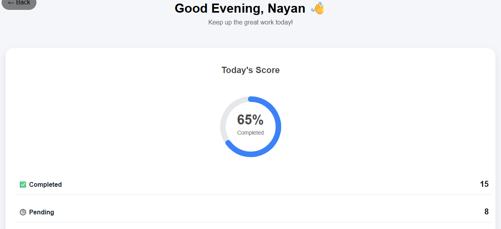
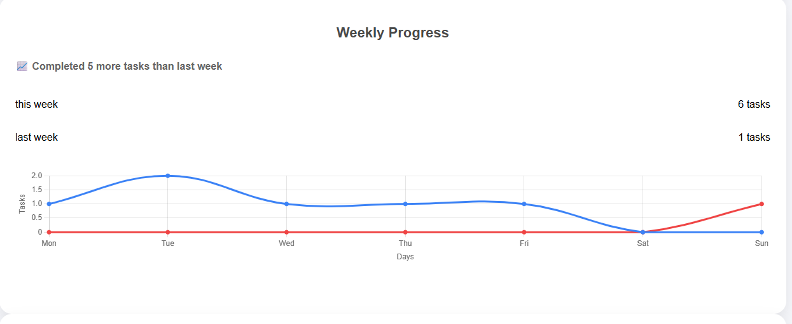
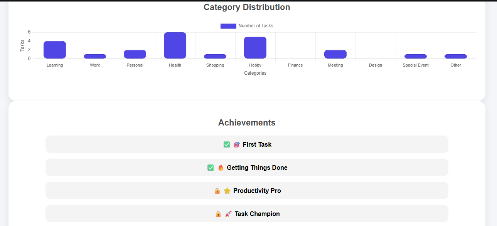

# TaskFlow 🚀

A productivity-focused task management web application built using Flask.  
TaskFlow helps users efficiently manage tasks with automatic categorization and a clean, responsive interface.

---

## Features

- Add multiple tasks at once
- Automatic category detection
- Task history tracking
- Sidebar navigation
- Responsive and clean UI

---

## Tech Stack

- Python
- Flask
- SQLite
- HTML
- CSS
- JavaScript

---

## Future Improvements

- Dashboard analytics with charts
- Productivity insights
- Category-wise statistics
- User authentication system
- Cloud deployment

---

##  Project Goal

This project is built to strengthen full-stack development skills using Flask and to understand real-world task management system design.

---

##  Screenshots

### Splash Page

### Home Page

### Add Task Page

### History Page

### Dashboard Page

---

##  Author

- Name: Nayan Mishra  
- Field: Information Technology Student  
- Goal: Full Stack Developer
